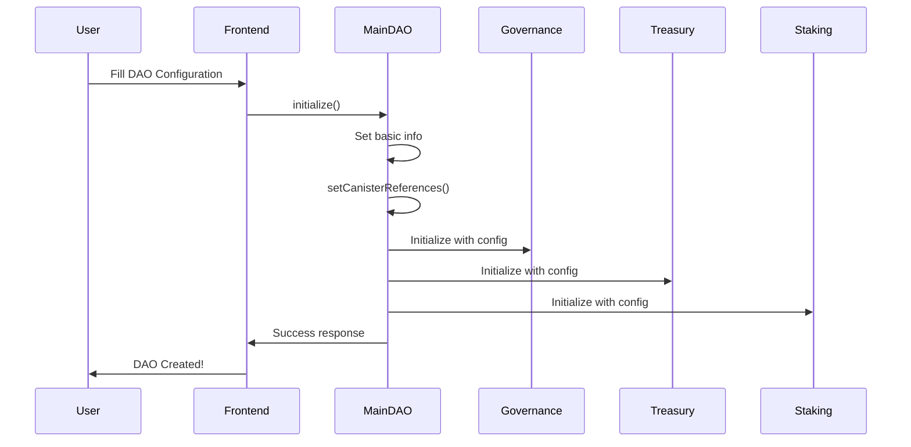
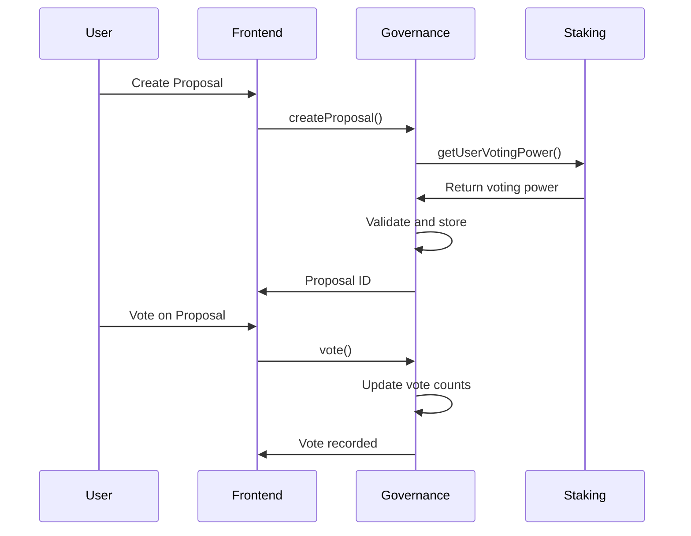

# DAO Launcher Kit - Developer Guide

## Table of Contents
- [Quick Start](#quick-start)
- [Architecture Overview](#architecture-overview)
- [Development Workflow](#development-workflow)
- [API Integration](#api-integration)
- [Testing Guide](#testing-guide)
- [Deployment Guide](#deployment-guide)
- [Troubleshooting](#troubleshooting)
- [Contributing](#contributing)

## Quick Start

### Prerequisites
```bash
# Install Node.js (v16+)
node --version  # Should be >= 16.0.0

# Install DFX (Internet Computer SDK)
sh -ci "$(curl -fsSL https://sdk.dfinity.org/install.sh)"
dfx --version

# Install dependencies
npm install
cd src/dao_frontend && npm install
```

### Local Development Setup
```bash
# 1. Clean start local Internet Computer replica
dfx stop  # Stop any running instance
dfx start --clean --background

# 2. Deploy all canisters using the automated script
./deploy.sh

# 3. Start frontend development server
cd src/dao_frontend
npm run dev
```

### Alternative Manual Deployment
```bash
# Deploy backend canisters in dependency order
dfx deploy dao_backend
dfx deploy dao_registry
dfx deploy dao_analytics
dfx deploy staking
dfx deploy treasury
dfx deploy proposals
dfx deploy assets

# Deploy governance with proper initialization
dfx deploy governance --argument "(principal \"$(dfx canister id dao_backend)\", principal \"$(dfx canister id staking)\")"

# Deploy Internet Identity for authentication
dfx deploy internet_identity

# Generate type declarations
dfx generate

# Deploy frontend
dfx deploy dao_frontend
```

### First DAO Creation
```bash
# Navigate to the application
open http://localhost:5173

# 1. Connect Internet Identity
# 2. Click "Launch DAO"
# 3. Follow the 7-step wizard
# 4. Launch your first DAO!
```

## Architecture Overview

### System Design Principles

#### 1. Microservices Architecture
The system uses a modular approach with eight specialized canisters:

```
┌─────────────────┐    ┌──────────────────┐    ┌─────────────────┐
│   Frontend      │────│   Main DAO       │────│   Governance    │
│   (React App)   │    │   Backend        │    │   Canister      │
│   + Vite        │    │   (Coordinator)  │    │   (Voting)      │
└─────────────────┘    └──────────────────┘    └─────────────────┘
                                │
                       ┌────────┼─────────┼────────┐
                       │        │         │        │
                ┌──────▼──┐ ┌───▼───┐ ┌──▼────┐ ┌─▼─────┐
                │ Staking │ │Treasury│ │Proposals│ │Assets │
                │Canister │ │Canister│ │Canister │ │Canist.│
                │(Rewards)│ │(Finance)│ │(Mgmt)   │ │(Files)│
                └─────────┘ └────────┘ └─────────┘ └───────┘
                       │                           │
                ┌──────▼──┐                 ┌──────▼──────┐
                │   DAO   │                 │ Analytics   │
                │Registry │                 │ Canister    │
                │(Discovery)               │ (Metrics)   │
                └─────────┘                 └─────────────┘
```

#### 2. Separation of Concerns
- **Main Backend (dao_backend)**: User management, coordination, and admin operations
- **DAO Registry (dao_registry)**: Global DAO discovery, search, and categorization
- **Analytics (dao_analytics)**: Platform metrics, event tracking, and historical data
- **Governance**: Voting mechanisms, proposal lifecycle, and decision execution
- **Staking**: Token locking, reward distribution, and voting power calculation
- **Treasury**: Financial operations, multi-sig wallets, and fund management
- **Proposals**: Proposal templates, categorization, and execution logic
- **Assets**: File storage, metadata management, and content distribution

#### 3. Upgrade Safety
All canisters implement upgrade-safe patterns:
```motoko
// Stable storage persists across upgrades
private var userProfiles : [(Principal, UserProfile)] = [];

// Runtime storage rebuilt after upgrades
private transient var userProfilesMap = HashMap.HashMap<Principal, UserProfile>(...);
```

### Data Flow Patterns

#### 1. DAO Creation Flow


#### 2. Governance Flow


## Development Workflow

### Backend Development

#### 1. Motoko Development
```bash
# Create new canister
touch src/dao_backend/new_module/main.mo

# Add to dfx.json
{
  "canisters": {
    "new_module": {
      "main": "src/dao_backend/new_module/main.mo",
      "type": "motoko"
    }
  }
}

# Deploy and test
dfx deploy new_module
dfx canister call new_module test_function
```

#### 2. Inter-Canister Communication
```motoko
// Define actor interface
let governance : actor {
    createProposal: shared (Text, Text) -> async Result<Nat, Text>;
} = actor("canister:governance");

// Make inter-canister call
let result = await governance.createProposal(title, description);
```

#### 3. Testing Backend Logic
```motoko
import Debug "mo:base/Debug";

// Debug logging
Debug.print("Creating proposal with ID: " # Nat.toText(proposalId));

// Testing with dfx
dfx canister call governance createProposal '("Test", "Description")'
```

### Frontend Development

#### 1. Component Development Pattern
```jsx
// Modern component structure with hooks
const MyComponent = () => {
    // 1. Context and custom hooks
    const { isAuthenticated } = useAuth();
    const { launchDAO, loading } = useDAOOperations();
    const { principal } = useAuth();
    
    // 2. Local state management
    const [formData, setFormData] = useState({});
    const [errors, setErrors] = useState({});
    
    // 3. Effects and lifecycle
    useEffect(() => {
        // Component initialization and cleanup
        return () => {
            // Cleanup logic
        };
    }, []);
    
    // 4. Event handlers with error handling
    const handleSubmit = async (event) => {
        event.preventDefault();
        try {
            setErrors({});
            await launchDAO(formData);
        } catch (error) {
            setErrors({ submit: error.message });
        }
    };
    
    // 5. Conditional rendering with loading states
    if (loading) {
        return <div className="flex items-center justify-center">
            <Loader2 className="animate-spin" />
        </div>;
    }
    
    // 6. Main render with proper accessibility
    return (
        <motion.div
            initial={{ opacity: 0 }}
            animate={{ opacity: 1 }}
            exit={{ opacity: 0 }}
        >
            {/* Component JSX with proper error boundaries */}
        </motion.div>
    );
};

export default MyComponent;
```

#### 2. State Management Pattern
```jsx
// Context providers with proper error handling
const DAOContext = createContext();

export const DAOProvider = ({ children }) => {
    const [daos, setDaos] = useState([]);
    const [loading, setLoading] = useState(false);
    const [error, setError] = useState(null);
    
    const createDAO = async (config) => {
        setLoading(true);
        setError(null);
        try {
            // API integration with proper error handling
            const result = await daoAPI.createDAO(config);
            setDaos(prev => [...prev, result]);
            return result;
        } catch (err) {
            setError(err.message);
            throw err;
        } finally {
            setLoading(false);
        }
    };
    
    return (
        <DAOContext.Provider value={{ daos, createDAO, loading, error }}>
            {children}
        </DAOContext.Provider>
    );
};

// Custom hooks for business logic
export const useDAO = () => {
    const context = useContext(DAOContext);
    if (!context) {
        throw new Error('useDAO must be used within DAOProvider');
    }
    return context;
};
```

#### 3. API Integration with Custom Hooks
```jsx
// Custom hook for DAO operations
import { useDAOAPI } from '../utils/daoAPI';
import { useAuth } from '../context/AuthContext';
import { Principal } from '@dfinity/principal';

export const useDAOOperations = () => {
    const daoAPI = useDAOAPI();
    const { principal } = useAuth();
    const [loading, setLoading] = useState(false);
    const [error, setError] = useState(null);

    const launchDAO = async (daoConfig) => {
        if (!daoAPI) {
            throw new Error('DAO API not initialized');
        }

        setLoading(true);
        setError(null);
        
        try {
            // Convert team member wallets to Principal objects
            const initialAdmins = daoConfig.teamMembers
                .map(member => member.wallet)
                .filter(wallet => wallet)
                .map(wallet => Principal.fromText(wallet));
            
            // Add creator as admin if not already included
            if (principal) {
                const creatorPrincipal = Principal.fromText(principal);
                const exists = initialAdmins.some(
                    admin => admin.toText() === creatorPrincipal.toText()
                );
                if (!exists) {
                    initialAdmins.push(creatorPrincipal);
                }
            }

            // Initialize DAO with proper error handling
            await daoAPI.initializeDAO(
                daoConfig.daoName,
                daoConfig.description,
                initialAdmins
            );

            // Set canister references for inter-canister communication
            await daoAPI.setCanisterReferences();

            // Configure DAO with full settings
            await daoAPI.setDAOConfig(daoConfig);

            return { success: true, daoId: daoConfig.daoName };
        } catch (error) {
            setError(error.message);
            throw error;
        } finally {
            setLoading(false);
        }
    };

    return { launchDAO, loading, error };
};
```

## API Integration

### 1. Authentication Setup
```javascript
// Initialize Internet Identity
import { AuthClient } from '@dfinity/auth-client';

const authClient = await AuthClient.create();

// Login flow
const login = async () => {
    await authClient.login({
        identityProvider: 'https://identity.ic0.app',
        onSuccess: () => {
            const identity = authClient.getIdentity();
            // Update app state
        }
    });
};
```

### 2. Canister Communication
```javascript
// Create actor instances
const actors = {
    daoBackend: Actor.createActor(daoBackendIdl, {
        agent: new HttpAgent({ host: 'http://localhost:4943' }),
        canisterId: import.meta.env.VITE_CANISTER_ID_DAO_BACKEND
    }),
    governance: Actor.createActor(governanceIdl, {
        agent: new HttpAgent({ host: 'http://localhost:4943' }),
        canisterId: import.meta.env.VITE_CANISTER_ID_GOVERNANCE
    })
};

// API call example
const createProposal = async (title, description) => {
    const result = await actors.governance.createProposal(
        title,
        description,
        { textProposal: null },
        null
    );
    
    if ('err' in result) {
        throw new Error(result.err);
    }
    
    return result.ok;
};
```

### 3. Error Handling Patterns
```javascript
// Centralized error handling
const handleAPIError = (error, context) => {
    console.error(`Error in ${context}:`, error);
    
    if (error.message.includes('Unauthorized')) {
        // Redirect to login
        navigate('/signin');
    } else if (error.message.includes('Network')) {
        // Show network error message
        showToast('Network error. Please try again.', 'error');
    } else {
        // Generic error handling
        showToast(error.message, 'error');
    }
};

// Usage in components
const MyComponent = () => {
    const callAPI = async () => {
        try {
            await actors.daoBackend.someMethod();
        } catch (error) {
            handleAPIError(error, 'MyComponent.callAPI');
        }
    };
};
```

## Testing Guide

### Backend Testing

#### 1. Unit Testing
```motoko
// test/governance.test.mo
import { describe; it; expect } from "mo:matchers/Matchers";
import Governance "../src/dao_backend/governance/main";

let tests = describe("Governance Tests", [
    it("should create proposal successfully", func() : Bool {
        let governance = Governance.GovernanceCanister();
        let result = await governance.createProposal(
            "Test Proposal",
            "Test Description",
            #textProposal,
            null
        );
        expect(result).toEqual(#ok(1));
    }),
    
    it("should reject unauthorized proposal creation", func() : Bool {
        // Test unauthorized access
        true // Placeholder
    })
]);
```

#### 2. Integration Testing
```bash
#!/bin/bash
# test/integration.sh

# Start local replica
dfx start --background --clean

# Deploy canisters
dfx deploy dao_backend
dfx deploy governance

# Run integration tests
dfx canister call dao_backend initialize '("Test DAO", "Description", vec {})'
dfx canister call governance createProposal '("Test", "Description", variant {textProposal}, null)'

# Cleanup
dfx stop
```

### Frontend Testing

#### 1. Component Testing
```javascript
// src/components/__tests__/LaunchDAO.test.jsx
import { render, screen, fireEvent, waitFor } from '@testing-library/react';
import { AuthProvider } from '../context/AuthContext';
import LaunchDAO from '../components/LaunchDAO';

// Mock dependencies
jest.mock('../hooks/useDAOOperations', () => ({
    useDAOOperations: () => ({
        launchDAO: jest.fn().mockResolvedValue({ success: true }),
        loading: false,
        error: null
    })
}));

describe('LaunchDAO Component', () => {
    const renderWithProviders = (component) => {
        return render(
            <AuthProvider>
                {component}
            </AuthProvider>
        );
    };
    
    test('renders launch form', () => {
        renderWithProviders(<LaunchDAO />);
        expect(screen.getByText('CREATE YOUR DAO')).toBeInTheDocument();
    });
    
    test('validates required fields', async () => {
        renderWithProviders(<LaunchDAO />);
        
        // Click start building
        fireEvent.click(screen.getByText('START BUILDING'));
        
        // Try to navigate without filling required fields
        fireEvent.click(screen.getByText('Next'));
        
        await waitFor(() => {
            expect(screen.getByText('DAO name is required')).toBeInTheDocument();
        });
    });
    
    test('successfully creates DAO', async () => {
        const mockLaunchDAO = jest.fn().mockResolvedValue({ success: true });
        
        renderWithProviders(<LaunchDAO />);
        
        // Fill out form and submit
        // ... test implementation
        
        await waitFor(() => {
            expect(mockLaunchDAO).toHaveBeenCalled();
        });
    });
});
```

#### 2. Hook Testing
```javascript
// src/hooks/__tests__/useDAOOperations.test.js
import { renderHook, act } from '@testing-library/react';
import { useDAOOperations } from '../useDAOOperations';

describe('useDAOOperations Hook', () => {
    test('launches DAO successfully', async () => {
        const { result } = renderHook(() => useDAOOperations());
        
        const daoConfig = {
            daoName: 'Test DAO',
            description: 'Test Description',
            category: 'DeFi'
        };
        
        await act(async () => {
            const response = await result.current.launchDAO(daoConfig);
            expect(response.success).toBe(true);
        });
    });
});
```

### End-to-End Testing

#### 1. Playwright Setup
```javascript
// tests/e2e/dao-creation.spec.js
import { test, expect } from '@playwright/test';

test.describe('DAO Creation Flow', () => {
    test('user can create a complete DAO', async ({ page }) => {
        // Navigate to app
        await page.goto('http://localhost:5173');
        
        // Connect wallet (mock)
        await page.click('text=Connect Wallet');
        
        // Start DAO creation
        await page.click('text=Launch DAO');
        await page.click('text=START BUILDING');
        
        // Fill Step 1: Basic Info
        await page.fill('[placeholder="Enter your DAO name"]', 'E2E Test DAO');
        await page.fill('textarea[placeholder*="Describe your DAO"]', 'A DAO created during E2E testing');
        await page.selectOption('select', 'DeFi');
        await page.click('text=Next');
        
        // Continue through all steps...
        
        // Launch DAO
        await page.click('text=Launch DAO');
        
        // Verify success
        await expect(page.locator('text=DAO launched successfully')).toBeVisible();
    });
});
```

## Deployment Guide

### Local Deployment
```bash
# Automated deployment with error handling
./deploy.sh

# Manual step-by-step deployment
dfx stop && dfx start --clean --background
dfx deploy dao_backend
dfx deploy staking
dfx deploy governance --argument "(principal \"$(dfx canister id dao_backend)\", principal \"$(dfx canister id staking)\")"
dfx deploy treasury
dfx deploy proposals  
dfx deploy assets
dfx deploy internet_identity
dfx generate
dfx deploy dao_frontend
```

### IC Mainnet Deployment
```bash
# Automated mainnet deployment with cycle management
./scripts/deploy-mainnet.sh

# This script handles:
# - Identity verification and cycle balance checking
# - Sequential canister deployment with proper dependencies
# - Environment variable generation for production
# - Frontend build optimization for mainnet
# - Verification of deployment success
```

### Environment Configuration
```javascript
// Local development (.env)
VITE_CANISTER_ID_DAO_BACKEND=rrkah-fqaaa-aaaaa-aaaaq-cai
VITE_CANISTER_ID_GOVERNANCE=rno2w-sqaaa-aaaaa-aaacq-cai
VITE_CANISTER_ID_STAKING=rkp4c-7iaaa-aaaaa-aaaca-cai
VITE_CANISTER_ID_TREASURY=rdmx6-jaaaa-aaaaa-aaadq-cai
VITE_CANISTER_ID_PROPOSALS=rrkah-fqaaa-aaaaa-aaaaq-cai
VITE_CANISTER_ID_ASSETS=rno2w-sqaaa-aaaaa-aaacq-cai
VITE_CANISTER_ID_INTERNET_IDENTITY=rdmx6-jaaaa-aaaaa-aaadq-cai
VITE_DFX_NETWORK=local
VITE_HOST=http://localhost:4943

// Production (.env.production) - Generated automatically by deploy script
VITE_CANISTER_ID_DAO_BACKEND=<mainnet-id>
VITE_CANISTER_ID_GOVERNANCE=<mainnet-id>
VITE_CANISTER_ID_STAKING=<mainnet-id>
VITE_CANISTER_ID_TREASURY=<mainnet-id>
VITE_CANISTER_ID_PROPOSALS=<mainnet-id>
VITE_CANISTER_ID_ASSETS=<mainnet-id>
VITE_CANISTER_ID_INTERNET_IDENTITY=rdmx6-jaaaa-aaaah-qdrqq-cai
VITE_DFX_NETWORK=ic
VITE_HOST=https://icp0.io
VITE_IC_HOST=https://icp0.io
VITE_NODE_ENV=production
```

### CI/CD Pipeline
```yaml
# .github/workflows/deploy.yml
name: Deploy to IC

on:
  push:
    branches: [main]

jobs:
  deploy:
    runs-on: ubuntu-latest
    steps:
      - uses: actions/checkout@v2
      
      - name: Install DFX
        run: sh -ci "$(curl -fsSL https://sdk.dfinity.org/install.sh)"
        
      - name: Start local replica
        run: dfx start --background
        
      - name: Deploy canisters
        run: |
          dfx deploy dao_backend
          dfx deploy governance
          dfx deploy treasury
          dfx deploy staking
          dfx deploy proposals
          dfx deploy assets
          dfx deploy dao_frontend
          
      - name: Run tests
        run: npm test
```

## Troubleshooting

### Common Issues

#### 1. Canister Communication Errors
```bash
# Check canister status
dfx canister status dao_backend

# Verify canister references
dfx canister call dao_backend getCanisterReferences

# Reset canister state
dfx canister uninstall-code dao_backend
dfx deploy dao_backend
```

#### 2. Frontend Connection Issues
```javascript
// Check if agent is properly configured
const agent = new HttpAgent({ 
    host: process.env.NODE_ENV === 'development' 
        ? 'http://localhost:4943' 
        : 'https://ic0.app' 
});

// Fetch root key for local development
if (process.env.NODE_ENV === 'development') {
    await agent.fetchRootKey();
}
```

#### 3. Authentication Problems
```javascript
// Clear auth client state
localStorage.removeItem('ic-delegation');
localStorage.removeItem('ic-identity');

// Reinitialize auth client
const authClient = await AuthClient.create();
```

### Debug Tools

#### 1. Backend Debugging
```motoko
import Debug "mo:base/Debug";

// Add debug prints
Debug.print("Proposal created with ID: " # Nat.toText(proposalId));
Debug.print("User voting power: " # Nat.toText(votingPower));

// Check debug output
dfx canister logs dao_backend
```

#### 2. Frontend Debugging
```javascript
// Enable detailed logging
window.localStorage.setItem('debug', 'dao:*');

// Use React DevTools
// Install: npm install -g react-devtools
// Usage: react-devtools

// Network debugging
const agent = new HttpAgent({ host: 'http://localhost:4943' });
agent.addTransform('request', (args) => {
    console.log('Request:', args);
    return args;
});
```

### Performance Optimization

#### 1. Backend Optimization
```motoko
// Use query calls when possible
public query func getDAOStats() : async DAOStats {
    // Read-only operations
}

// Batch operations
public func batchUpdateProposals(proposals: [ProposalUpdate]) : async [Result<(), Text>] {
    // Process multiple updates in one call
}
```

#### 2. Frontend Optimization
```javascript
// Use React.memo for expensive components
const ExpensiveComponent = React.memo(({ data }) => {
    // Component implementation
});

// Implement virtual scrolling for large lists
import { FixedSizeList as List } from 'react-window';

// Cache API responses
const cache = new Map();
const cachedAPICall = async (key, apiCall) => {
    if (cache.has(key)) {
        return cache.get(key);
    }
    const result = await apiCall();
    cache.set(key, result);
    return result;
};
```

## Contributing

### Code Style Guidelines

#### 1. Motoko Style
```motoko
// Use descriptive names
public func createProposal(title: Text, description: Text) : async Result<ProposalId, GovernanceError>

// Add type annotations
let proposalId : ProposalId = nextProposalId;

// Use proper error handling
switch (result) {
    case (#ok(value)) { /* handle success */ };
    case (#err(error)) { /* handle error */ };
};
```

#### 2. JavaScript/React Style
```javascript
// Use meaningful component names
const DAOCreationWizard = () => { ... };

// Destructure props
const MyComponent = ({ title, onSubmit, isLoading }) => { ... };

// Use hooks consistently
const useAPICall = (endpoint) => {
    const [data, setData] = useState(null);
    const [loading, setLoading] = useState(false);
    const [error, setError] = useState(null);
    
    // Implementation
};
```

### Pull Request Process

1. **Fork the repository**
2. **Create feature branch**: `git checkout -b feature/new-feature`
3. **Write tests** for new functionality
4. **Ensure all tests pass**: `npm test`
5. **Update documentation** if needed
6. **Submit pull request** with detailed description

### Development Best Practices

1. **Write comprehensive tests** for all new features
2. **Follow security best practices** for IC development
3. **Use proper error handling** throughout the codebase
4. **Document complex business logic** with inline comments
5. **Optimize for gas efficiency** in backend operations
6. **Ensure responsive design** for frontend components
7. **Implement proper loading states** and error boundaries

This developer guide provides a complete reference for working with the DAO Launcher Kit codebase, from initial setup through production deployment and ongoing maintenance.
